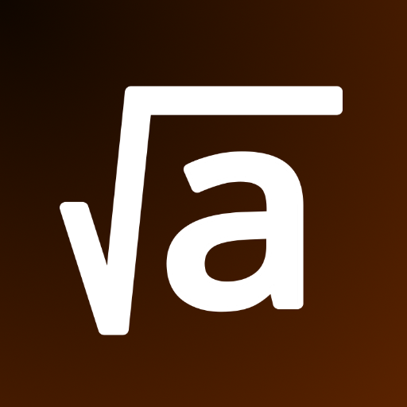

# aDev Class

Repositório destinado a mentoria e incentivo de iniciantes na programação.

Abordaremos conceitos fundamentais nas diferentes linguagens de programação.

Aqui você vai desenvolver a lógica e o pensamento computacional!

## Tópicos

Separamos as sessões em tópicos, que serão explicados nos contextos de cada linguagem, com o intuito de facilitar
a criação de paralelos entre a linguagem que você já sabe e a que deseja aprender.

### Setup

- Como Instalar
- Como compilar e executar

### Introdução

- Palavras-chave e Identificadores
- Variáveis e Constantes
- Tipos
- Input/Output
- Operadores
- Exemplos
