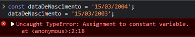

# Variáveis e Constantes

Agora que você conseguiu escrever e rodar suas primeiras linhas de código em `JS`.

Vamos aprender um pouco mais sobre o que são variáveis e constantes.

## O que são variáveis?

Em poucas palavras, **variáveis** são espaços na memória do computador que armazenam valores.

Imagine que você queira guardar o dia da semana em uma variável, para isso, em JavaScript, você pode fazer o seguinte:

```js
let diaDaSemana = 'Segunda-feira';
```

Agora imaginemos que um dia se passou, e você precisa atualizar o valor da variável `diaDaSemana` para `Terça-feira`, para isso, você pode fazer o seguinte:

```js
diaDaSemana = 'Terça-feira';
```

O que aconteceu aqui?

- Criamos uma variável chamada `diaDaSemana` e atribuímos o valor `'Segunda-feira'` a ela.
- Depois, atualizamos o valor da variável `diaDaSemana` para `'Terça-feira'`.

Isso é possível porque, em JavaScript, você pode alterar o valor de uma variável a qualquer momento.

## O que são constantes?

Em poucas palavras, **constantes** são espaços na memória do computador que armazenam valores que **_não_** podem ser alterados.

Imagine que você queira guardar a data de nascimento de uma pessoa, é garantido que essa data não vai mudar, certo?

Portanto, você pode seguramente criar uma constante para guardar essa informação:

```js
const dataDeNascimento = '15/03/2004';
```

Entretanto, se tentarmos atribuir um novo valor a essa constante, o JavaScript irá nos avisar que não é possível fazer isso:

```js
dataDeNascimento = '15/03/2003';
```



Ocorreu um erro, pois não é possível alterar o valor de uma constante.

## Como declarar variáveis e constantes?

Existem três formas de declarar variáveis e constantes em JavaScript:

- `var`
- `let`
- `const`

### `var`

A forma mais antiga de declarar variáveis e constantes em JavaScript é usando a palavra-chave `var`.

```js
var nomeDaVariavel = 'valor';
```

Porém, essa forma de declarar variáveis e constantes está obsoleta e não é considerado uma boa prática utilizá-la.<br/>
[Explicação mais detalhada das limitações do var](https://javascript.plainenglish.io/4-reasons-why-var-is-considered-obsolete-in-modern-javascript-a30296b5f08f)

### `let`

A forma mais utilizada atualmente para declarar variáveis em JavaScript é usando a palavra-chave `let`.

```js
let nomeDaVariavel = 'valor';
```

### `const`

A forma mais utilizada atualmente para declarar constantes em JavaScript é usando a palavra-chave `const`.

```js
const nomeDaConstante = 'valor';
```

## Variáveis Globais, Locais e Escopo

Em JavaScript, existem dois níveis de acesso a variáveis e constantes, **global** e **local**.

### Escopo

O **escopo** de uma variável é o local onde ela pode ser acessada.

Em JavaScript, assim como em outras linguagens de programação, as chaves `{}` delimitam um escopo, ou em outras palavras, um bloco de código.

Por exemplo, se você criar uma variável dentro de um bloco de código, essa variável só poderá ser acessada dentro desse bloco de código.

```js
{
  let nomeDaPessoa1 = 'Aluisio';
  console.log(nomeDaPessoa1);
}
{
  let nomeDaPessoa2 = 'Alexandre';
  console.log(nomeDaPessoa2);
}
console.log(nomeDaPessoa1);
console.log(nomeDaPessoa2);
```

Se executarmos esse código, receberemos um erro, pois as variáveis `nomeDaPessoa1` e `nomeDaPessoa2` só podem ser acessadas dentro do bloco de código em que foram criadas.


### Variáveis Globais

Variáveis globais são variáveis que podem ser acessadas em qualquer lugar do código.

Ou seja, são variáveis que não estão dentro de nenhum bloco de código ou escopo.

Por exemplo, se você criar uma variável global chamada `nomeDaPessoa`, você poderá acessá-la em qualquer lugar do código.

```js
let nomeDaPessoa = 'Aluisio';

{
  console.log(nomeDaPessoa);
}
```

O código acima irá imprimir o valor da variável `nomeDaPessoa` no console, pois ela é uma variável global, e pode ser acessada dentro de qualquer escopo.

### Variáveis Locais

Variáveis locais são variáveis que só podem ser acessadas dentro do escopo em que foram criadas.

Por exemplo, se você criar uma variável local chamada `nomeDaPessoa`, você só poderá acessá-la dentro do escopo em que ela foi criada.

```js
{
  let nomeDaPessoa = 'Aluisio';
  console.log(nomeDaPessoa);
}
console.log(nomeDaPessoa);
```

O código acima irá gerar um erro, pois a variável `nomeDaPessoa` só pode ser acessada dentro do escopo em que foi criada.
