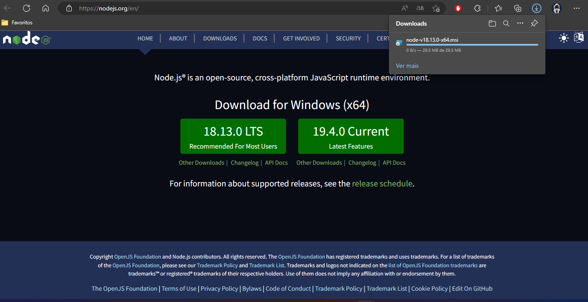
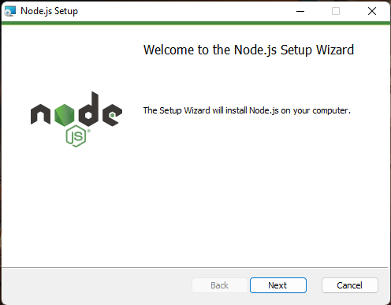
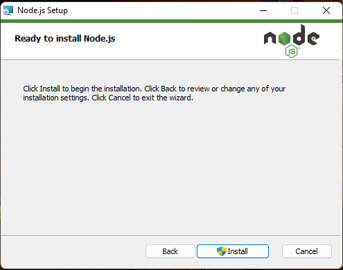
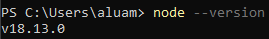

# Instalação

O primeiro passo, para seguir este guia, é instalar o [NodeJS](https://nodejs.org/en/).
Isso é muito fácil!

## Como instalar o Node?

### Windows

- Primeiro acesse: https://nodejs.org/en/
- Clique em "Download" e escolha a versão LTS (Long Term Support) para Windows.

  

- Execute o arquivo de instalação

  

- "next" -> "next" ... -> "install"

  

- Abra o seu terminal e digite:

```bash
node --version
```

Se tudo correu bem, você verá a versão instalada do seu Node.<br/>
Pronto, já pode usar! 🥳🎉🎊



### Linux

- Primeiramente, você precisará do [curl](https://curl.se/). Para instalá-lo é simples, apenas cole no seu terminal:

```bash
sudo apt-get install curl
```

- Depois, utilizando o **curl**, requisite o repositório do Node:<br/>
  > _Obs: Na data da publicação deste, a versão atual do **NodeJS** é a 18._<br/> > _Sinta-se a vontade para baixar a versão que preferir._

```bash
curl -fsSL https://deb.nodesource.com/setup_18.x | sudo -E bash - &&\
```

- Por fim, verifique se a instalação funcionou corretamente:

```bash
node -v
```

_voilá!_ 🥳🎉🎊
